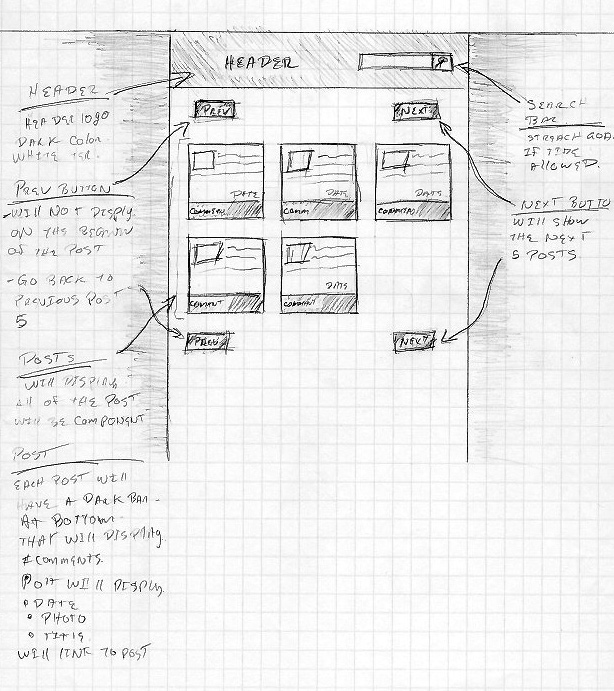

## ORIM Reddit Post Code Challenge
Using React and the Reddit API. Create an app that will display the hot reddit posts in a grid format.  Please allow the user to paginate through the posts. When complete please push your code to a Github repo and provide Open Road Media with a link.

#### Acceptance Criteria
* Display 5 posts at a time.
* Allow the user to paginate through the posts
* Style the grid and layout

#### Bonus Criteria (optional)
* Create  a page to allow us to view a post and its comments by itself. 
* Create units tests for created components.
* Create a search interface that allows you to do a fuzzy search on reddit posts. 

#### API Reference
API Docs:
https://www.reddit.com/dev/API/

Reddit Hot Posts
https://www.reddit.com/r/all/hot

#### File structure

        project/src
        | node_modules
        | components
            |__ Buttons
            |__ Comments
            |__ Header
            |__ List
            |__ Post
            |__ Posts
            |__ Root
        | Sass  
            |__ _app.scss
            |__ _index.scss
            |__ _normalize.scss
            |__  App.css
            |__  main.scss
        App.js
        package.json
        README.md
#### Skecth

#### completed 
* Display 5 posts at a time.
* Allow the user to paginate through the posts
* Style the grid and layout
* search filter current post displaying 
* view a post and its comments by itself

#### Run Code
*   npm install - to load all of the node modules
*   npm start - to run local server on localhost:3000

### components

* <strong>stateless components </strong>

  since this component are stateless don't need to be a class or extend from react component

  * Buttons - This component holds the buttons that allow the user to paginate to the five post and also to the previous five posts, it links up to its parent component when clicked and it triggers the nextPosts() and prevPost()

  * Comments - it only is used to display the comments from post that is selected, only display the first tier of posts

  * Post - it displays all of the information about post been render on the list component, it's used to display the image, title, date, # comment, score

  * header - only holds the header title information

  * Root- holds the header and the (this.props.children) that is the postView and IndexRoute on the App.js  

* <strong> components that have state </strong>
  * List - This component makes the API call to fetch the data that get display on the home it also is set to be the IndexRoute on the app.js with react-route  
  sets the state of the posts passes props to the Post, Buttons components

  * postView - This component makes an API call to fetch a single post information that holds the replies to the post.
  It gets the post information data from the params when click on the comments links, to build the query string and use to make the fetch.
